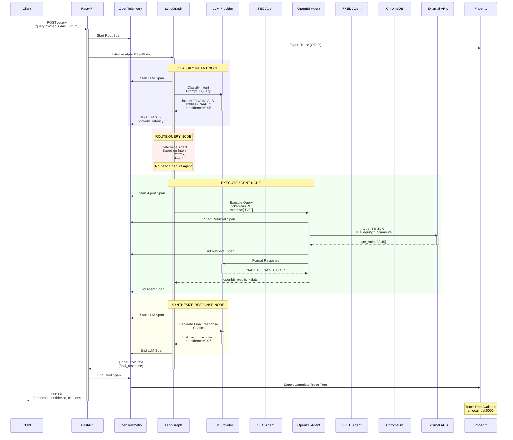
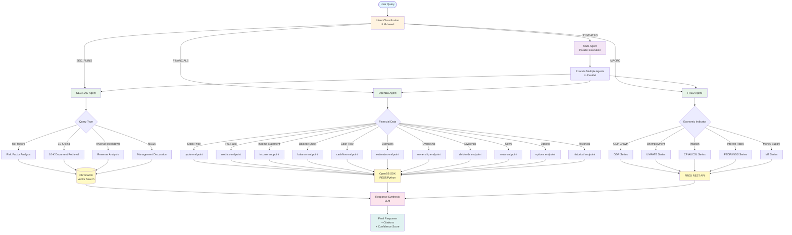

<div align="center">

# 🚀 AlphaEdge

### AI-Powered Multi-Agent Financial Research Platform

[](https://python.org)
[](https://fastapi.tiangolo.com)
[](https://langchain-ai.github.io/langgraph/)
[](https://openbb.co)
[](https://docker.com)

**Enterprise-grade multi-agent AI system for comprehensive market research, investment analysis, and financial intelligence.**

[Features](#-features) • [Architecture](#-system-architecture) • [Quick Start](#-quick-start) • [API Reference](#-api-reference) • [Contributing](#-contributing)

---

</div>

## 📋 Table of Contents

- [Overview](#-overview)
- [Features](#-features)
- [System Architecture](#-system-architecture)
- [Tech Stack](#-tech-stack)
- [Quick Start](#-quick-start)
- [Configuration](#-configuration)
- [Usage](#-usage)
- [API Reference](#-api-reference)
- [Observability](#-observability)
- [Testing](#-testing)
- [Project Structure](#-project-structure)
- [Contributing](#-contributing)
- [License](#-license)

---

## 🎯 Overview

AlphaEdge is a production-ready **multi-agent AI system** that orchestrates specialized agents to retrieve, analyze, and synthesize financial information from multiple authoritative sources. Built with modern AI/ML best practices, it provides institutional-grade market research capabilities.

### Why AlphaEdge?

| Challenge | AlphaEdge Solution |
|-----------|-------------------|
| Fragmented data sources | Unified interface to SEC, market data, and macro indicators |
| Hallucination in LLMs | RAG with citation validation and faithfulness scoring |
| Slow research workflows | Parallel agent execution with intelligent routing |
| Black-box AI responses | Full observability with Arize Phoenix tracing |
| Scalability concerns | Stateless design with horizontal scaling support |

---

## ✨ Features

### 🤖 Multi-Agent Intelligence

| Agent | Data Source | Capabilities |
|-------|-------------|--------------|
| **SEC RAG Agent** | SEC EDGAR | 10-K, 10-Q, 8-K filing analysis with vector search |
| **OpenBB Agent** | OpenBB Platform | Real-time quotes, fundamentals, estimates, ownership |
| **FRED Agent** | Federal Reserve | GDP, CPI, unemployment, interest rates, money supply |

### 🔄 Intelligent Orchestration

- **Intent Classification**: Automatic query categorization (SEC/Financials/Macro/Synthesis)
- **Complexity Detection**: Identifies complex queries requiring multi-task decomposition
- **LLM-Based Decomposition**: Automatically breaks down complex queries into executable tasks
- **Smart Routing**: Dynamic agent selection based on query intent
- **Sequential Task Execution**: Dependency-aware task execution for stability
- **Result Synthesis**: Combines multi-source data into coherent insights
- **State Management**: Conversation memory with checkpointing

### 🛡️ Enterprise Guardrails

- **Faithfulness Scoring**: Validates LLM responses against source documents
- **Citation Validation**: Every claim backed by verifiable sources
- **Confidence Metrics**: Quantified reliability scores per response
- **Input Validation**: Pydantic schemas for request/response validation

### 📊 Full Observability

- **Arize Phoenix**: LLM-specific tracing with OpenInference semantics
- **OpenTelemetry**: Distributed tracing across all components
- **Metrics Export**: Prometheus-compatible metrics endpoint
- **Span Attributes**: Token counts, latency, model details, retrieval scores

### 🍎 Local-First AI

- **MLX Support**: Apple Silicon optimized inference with MLX-LM
- **Quantized Models**: 4-bit models for 16GB RAM MacBooks
- **No Cloud Required**: Fully functional offline with local models

---

## 🏗️ System Architecture

### High-Level Architecture

```mermaid
%%{init: {'theme': 'base', 'themeVariables': { 'primaryColor':'#ffffff', 'primaryBorderColor':'#333333', 'primaryBkg':'#ffffff', 'primaryTextColor':'#000000', 'background':'#ffffff', 'mainBkg':'#ffffff', 'secondBkg':'#ffffff', 'clusterBkg':'#ffffff', 'clusterBorder':'#333333', 'lineColor':'#333333', 'edgeLabelBackground':'#ffffff'}, 'darkMode': false}}%%
graph TB
    subgraph CLIENT["🖥️ CLIENT LAYER"]
        UI[Streamlit UI<br/>Port 8501]
        REST[REST Client]
        CLI[CLI Tool]
    end
    
    subgraph API["🌐 API LAYER"]
        FastAPI[FastAPI Application<br/>Port 8000]
        
        subgraph Endpoints
            Query[POST /query]
            Health[GET /health]
            Metrics[GET /metrics]
        end
        
        OTEL[OpenTelemetry<br/>Instrumentation]
    end
    
    subgraph ORCHESTRATION["⚙️ ORCHESTRATION LAYER"]
        LangGraph[LangGraph State Machine]
        
        Classify[Classify Intent<br/>+ Complexity Detection<br/>LLM]
        Route{Route Decision}
        
        subgraph SimplePath["Fast Path - Simple Queries"]
            DirectRoute[Direct Agent<br/>Routing]
        end
        
        subgraph ComplexPath["Multi-Task Pipeline - Complex Queries"]
            Decompose[Query Decomposer<br/>LLM Task Generation]
            TaskExec[Task Executor<br/>Sequential Execution]
            Synthesize[Synthesis Agent<br/>Result Aggregation]
        end
        
        subgraph State["📦 AlphaEdgeState"]
            StateData["• query, intent, entities<br/>• is_complex, task_plan<br/>• task_results, citations<br/>• confidence_score"]
        end
    end
    
    subgraph AGENTS["🤖 AGENT LAYER"]
        subgraph SEC["SEC RAG Agent"]
            SEC1[10-K/10-Q Analysis]
            SEC2[Risk Factors]
            SEC3[MD&A Sections]
            ChromaDB[(ChromaDB<br/>Vector Search)]
        end
        
        subgraph OpenBB["OpenBB Agent"]
            OBB1[Stock Quotes]
            OBB2[Fundamentals]
            OBB3[12+ Endpoints]
            OBBSDK[OpenBB SDK<br/>REST/Python]
        end
        
        subgraph FRED["FRED Agent"]
            FRED1[GDP/Unemployment]
            FRED2[Inflation/CPI]
            FRED3[Interest Rates]
            FREDAPI[FRED API<br/>REST]
        end
        
        SynthesisAgent[Synthesis Agent<br/>Multi-Source Combining]
    end
    
    subgraph MODELS["🧠 MODEL LAYER"]
        subgraph LLM["LLM Providers"]
            MLX[MLX<br/>Qwen2.5-3B-4bit<br/>Local/Apple Silicon]
            OpenAI[OpenAI<br/>GPT-4o<br/>Cloud API]
            Anthropic[Anthropic<br/>Claude 3.5<br/>Cloud API]
        end
        
        Embeddings[Embeddings<br/>all-MiniLM-L6-v2<br/>384 dimensions]
    end
    
    subgraph DATA["💾 DATA & STORAGE LAYER"]
        Chroma[(ChromaDB<br/>Port 8001<br/>SEC Filings)]
        Redis[(Redis<br/>Port 6379<br/>Cache)]
        EDGAR[SEC EDGAR<br/>External API<br/>10-K/10-Q/8-K]
    end
    
    subgraph OBSERVABILITY["📊 OBSERVABILITY LAYER"]
        Phoenix[Arize Phoenix<br/>Port 6006]
        
        subgraph Traces
            LLMTrace[LLM Traces<br/>Prompts/Tokens]
            RetrTrace[Retrieval Traces<br/>Docs/Scores]
            EmbTrace[Embedding Traces<br/>Vectors/Latency]
            TaskTrace[Task Execution<br/>Multi-Agent Flow]
        end
        
        OpenInference[OpenInference<br/>Semantic Conventions<br/>OTLP Export]
    end
    
    UI --> FastAPI
    REST --> FastAPI
    CLI --> FastAPI
    
    FastAPI --> Query
    FastAPI --> Health
    FastAPI --> Metrics
    FastAPI --> OTEL
    
    OTEL -.-> Phoenix
    
    FastAPI --> LangGraph
    LangGraph --> Classify
    Classify --> Route
    
    Route -->|Simple Query| DirectRoute
    Route -->|Complex Query| Decompose
    
    DirectRoute --> SEC
    DirectRoute --> OpenBB
    DirectRoute --> FRED
    
    Decompose --> TaskExec
    TaskExec -->|Task 1| SEC
    TaskExec -->|Task 2| OpenBB
    TaskExec -->|Task 3| FRED
    TaskExec --> Synthesize
    
    Synthesize --> SynthesisAgent
    
    SEC1 --> ChromaDB
    SEC2 --> ChromaDB
    SEC3 --> ChromaDB
    
    OBB1 --> OBBSDK
    OBB2 --> OBBSDK
    OBB3 --> OBBSDK
    
    FRED1 --> FREDAPI
    FRED2 --> FREDAPI
    FRED3 --> FREDAPI
    
    Classify -.-> MLX
    Classify -.-> OpenAI
    Decompose -.-> MLX
    TaskExec -.-> MLX
    SynthesisAgent -.-> MLX
    
    ChromaDB -.-> Embeddings
    
    SEC --> Chroma
    OBBSDK --> Redis
    EDGAR -.-> Chroma
    
    Phoenix --> LLMTrace
    Phoenix --> RetrTrace
    Phoenix --> EmbTrace
    Phoenix --> TaskTrace
    Phoenix --> OpenInference
    
    style CLIENT fill:#ffffff,stroke:#333,stroke-width:2px,color:#000,font-weight:bold
    style API fill:#ffffff,stroke:#333,stroke-width:2px,color:#000,font-weight:bold
    style ORCHESTRATION fill:#ffffff,stroke:#333,stroke-width:2px,color:#000,font-weight:bold
    style AGENTS fill:#ffffff,stroke:#333,stroke-width:2px,color:#000,font-weight:bold
    style MODELS fill:#ffffff,stroke:#333,stroke-width:2px,color:#000,font-weight:bold
    style DATA fill:#ffffff,stroke:#333,stroke-width:2px,color:#000,font-weight:bold
    style OBSERVABILITY fill:#ffffff,stroke:#333,stroke-width:2px,color:#000,font-weight:bold
    style SimplePath fill:#ffffff,stroke:#333,stroke-width:2px,color:#000,font-weight:bold
    style ComplexPath fill:#ffffff,stroke:#333,stroke-width:2px,color:#000,font-weight:bold
    
    style FastAPI fill:#ff9800,color:#fff,font-weight:bold
    style LangGraph fill:#9c27b0,color:#fff,font-weight:bold
    style Phoenix fill:#00bcd4,color:#fff,font-weight:bold
    style Route fill:#f44336,color:#fff,font-weight:bold
    style Decompose fill:#ff5722,color:#fff,font-weight:bold
```



### Data Flow Sequence

```
┌──────┐     ┌──────┐     ┌─────────┐     ┌───────┐     ┌──────┐
│Client│     │ API  │     │LangGraph│     │ Agent │     │ Data │
└──┬───┘     └──┬───┘     └────┬────┘     └───┬───┘     └──┬───┘
   │            │              │              │            │
   │ POST /query│              │              │            │
   │───────────▶│              │              │            │
   │            │              │              │            │
   │            │ invoke()     │              │            │
   │            │─────────────▶│              │            │
   │            │              │              │            │
   │            │              │classify_intent            │
   │            │              │─────────────▶│            │
   │            │              │              │ LLM call   │
   │            │              │              │───────────▶│
   │            │              │              │◀───────────│
   │            │              │◀─────────────│            │
   │            │              │              │            │
   │            │              │route_by_intent            │
   │            │              │──────┐       │            │
   │            │              │      │       │            │
   │            │              │◀─────┘       │            │
   │            │              │              │            │
   │            │              │run_agent     │            │
   │            │              │─────────────▶│            │
   │            │              │              │ _retrieve  │
   │            │              │              │───────────▶│
   │            │              │              │◀───────────│
   │            │              │              │ _generate  │
   │            │              │              │───────────▶│
   │            │              │              │◀───────────│
   │            │              │◀─────────────│            │
   │            │              │              │            │
   │            │◀─────────────│              │            │
   │            │              │              │            │
   │◀───────────│              │              │            │
   │  Response  │              │              │            │
```

### Data Flow Sequence



### Agent Decision Tree



---

## 🛠️ Tech Stack

### Core Framework

| Component | Technology | Purpose |
|-----------|------------|---------|
| **Runtime** | Python 3.11+ | Core language |
| **API** | FastAPI | REST API with async support |
| **Orchestration** | LangGraph | Multi-agent state machine |
| **Vector DB** | ChromaDB | Document embeddings storage |
| **Cache** | Redis | Query caching and rate limiting |

### AI/ML

| Component | Technology | Purpose |
|-----------|------------|---------|
| **Local LLM** | MLX-LM | Apple Silicon optimized inference |
| **Cloud LLM** | OpenAI / Anthropic | Production LLM providers |
| **Embeddings** | sentence-transformers | Document vectorization |
| **RAG** | LangChain | Retrieval augmented generation |

### Data Sources

| Source | API | Data Types |
|--------|-----|------------|
| **SEC EDGAR** | REST | 10-K, 10-Q, 8-K filings |
| **OpenBB** | Python SDK | Quotes, fundamentals, estimates, ownership |
| **FRED** | REST | Macro indicators (GDP, CPI, unemployment) |

### Observability

| Component | Technology | Purpose |
|-----------|------------|---------|
| **LLM Tracing** | Arize Phoenix | LLM observability UI |
| **Instrumentation** | OpenTelemetry | Distributed tracing |
| **Semantics** | OpenInference | LLM-specific span attributes |

### Infrastructure

| Component | Technology | Purpose |
|-----------|------------|---------|
| **Containers** | Docker | Containerized deployment |
| **Orchestration** | Docker Compose | Multi-service management |
| **Frontend** | Streamlit | Interactive web UI |

---

## 🚀 Quick Start

### Prerequisites

- **Python 3.11+**
- **Docker & Docker Compose** (for full stack)
- **16GB RAM** (for local LLM inference)
- **Apple Silicon Mac** (for MLX acceleration) or any system for cloud LLM

### Option 1: Local Development (Recommended)

```bash
# Clone the repository
git clone https://github.com/kaushikkumarkr/AlphaEdge.git
cd AlphaEdge

# Create virtual environment
python -m venv venv
source venv/bin/activate  # Windows: venv\Scripts\activate

# Install dependencies
pip install -e ".[dev]"

# Copy and configure environment
cp .env.example .env
# Edit .env with your API keys

# Start Docker services (ChromaDB, Redis, Phoenix)
docker compose -f docker-compose.local.yml up -d

# Run the API server
uvicorn src.api.main:app --reload --port 8000

# (Optional) Run Streamlit frontend
streamlit run frontend/app.py
```

### Option 2: Full Docker Stack

```bash
# Clone and enter directory
git clone https://github.com/kaushikkumarkr/AlphaEdge.git
cd AlphaEdge

# Configure environment
cp .env.example .env
# Edit .env with your API keys

# Start all services
docker compose up --build

# Access:
# - API: http://localhost:8000
# - Frontend: http://localhost:8501
# - Phoenix: http://localhost:6006
```

---

## ⚙️ Configuration

### Environment Variables

Create a `.env` file in the project root:

```bash
# === LLM Configuration ===
# For local inference (Apple Silicon)
USE_LOCAL_LLM=true
MLX_MODEL=mlx-community/Qwen2.5-3B-Instruct-4bit

# For cloud LLM (optional)
OPENAI_API_KEY=sk-...
ANTHROPIC_API_KEY=sk-ant-...

# === Data Sources ===
FRED_API_KEY=your_fred_api_key  # https://fred.stlouisfed.org/docs/api/api_key.html
SEC_USER_AGENT=YourName your@email.com

# === Infrastructure ===
CHROMA_HOST=localhost
CHROMA_PORT=8001
REDIS_URL=redis://localhost:6379

# === Observability ===
OTLP_ENDPOINT=http://localhost:4317
PHOENIX_ENABLED=true
```

### Model Configuration

Edit `config/model.yaml` for model settings:

```yaml
llm:
  provider: mlx  # or openai, anthropic
  model: mlx-community/Qwen2.5-3B-Instruct-4bit
  temperature: 0.3
  max_tokens: 2048

embedding:
  model: all-MiniLM-L6-v2
  dimension: 384

retrieval:
  top_k: 5
  min_score: 0.7
```

---

## 📖 Usage

### API Endpoints

#### Query Endpoint

```bash
curl -X POST http://localhost:8000/query \
  -H "Content-Type: application/json" \
  -d '{
    "query": "What is Apple'\''s P/E ratio and how does it compare to the industry?",
    "ticker": "AAPL"
  }'
```

**Response:**

```json
{
  "response": "Apple's current P/E ratio is 34.13, which is above the tech sector average of 28.5...",
  "citations": [
    {
      "source_type": "financial_data",
      "source_id": "openbb-metrics-AAPL",
      "text_excerpt": "P/E Ratio: 34.13\nMarket Cap: $3,572,231,045,120...",
      "relevance_score": 0.9
    }
  ],
  "confidence": 0.92,
  "intent": "FINANCIALS",
  "processing_time_ms": 1234.56
}
```

### Example Queries

| Query Type | Example |
|------------|---------|
| **SEC Analysis** | "What are Apple's main risk factors from their latest 10-K?" |
| **Valuation** | "What is Tesla's P/E ratio and EV/EBITDA?" |
| **Fundamentals** | "Show me Microsoft's revenue and profit margins" |
| **Analyst Views** | "What do analysts think about NVDA? Price targets?" |
| **Macro Data** | "How has GDP growth been trending?" |
| **Ownership** | "Who are the largest institutional holders of AAPL?" |

---

## 📊 Observability

### Arize Phoenix Dashboard

Access the Phoenix UI at `http://localhost:6006` to view:

- **LLM Traces**: Full prompt/completion visibility
- **Retrieval Traces**: Document search queries and results
- **Embedding Traces**: Vector operations with scores
- **Latency Analysis**: End-to-end timing breakdown
- **Token Usage**: Input/output token counts per request

### Trace Attributes

All spans include OpenInference semantic attributes:

```python
# LLM Spans
span.set_attribute(SpanAttributes.LLM_MODEL_NAME, "Qwen2.5-3B")
span.set_attribute(SpanAttributes.LLM_INPUT_MESSAGES, messages)
span.set_attribute(SpanAttributes.LLM_OUTPUT_MESSAGES, response)
span.set_attribute("llm.token_count.input", 150)
span.set_attribute("llm.token_count.output", 250)

# Retriever Spans
span.set_attribute(SpanAttributes.RETRIEVAL_DOCUMENTS, docs)
span.set_attribute("retriever.top_k", 5)
span.set_attribute("retriever.top_score", 0.92)

# Agent Spans
span.set_attribute("agent.type", "openbb")
span.set_attribute("agent.confidence_score", 0.95)
```

---

## 🧪 Testing

### Run All Tests

```bash
# Unit tests
pytest tests/ -v

# With coverage
pytest tests/ --cov=src --cov-report=html

# Integration tests
pytest tests/integration/ -v
```

### Test Individual Components

```bash
# Test OpenBB Agent
python test_openbb_agent.py

# Test Phoenix Tracing
python test_phoenix_tracing.py

# Test full pipeline
python test_sprint8.py
```

---

## 📁 Project Structure

```
alphaedge/
├── src/
│   ├── agents/                 # AI Agents
│   │   ├── base_agent.py       # Abstract base class
│   │   ├── sec_rag_agent.py    # SEC filing analysis
│   │   ├── openbb_agent.py     # Financial data (12+ endpoints)
│   │   └── fred_agent.py       # Macro indicators
│   │
│   ├── api/                    # FastAPI application
│   │   └── main.py             # REST endpoints
│   │
│   ├── orchestration/          # LangGraph workflow
│   │   ├── graph.py            # State machine definition
│   │   ├── nodes.py            # Graph nodes (classify, route, execute)
│   │   └── state.py            # TypedDict state schema
│   │
│   ├── data/                   # Data layer
│   │   ├── vector_store.py     # ChromaDB wrapper
│   │   ├── embeddings.py       # Embedding model
│   │   └── sec_client.py       # SEC EDGAR client
│   │
│   ├── models/                 # LLM abstraction
│   │   ├── base_model.py       # Abstract interface
│   │   └── mlx_model.py        # MLX-LM implementation
│   │
│   ├── guardrails/             # Validation & safety
│   │   └── schemas.py          # Pydantic models
│   │
│   ├── utils/                  # Utilities
│   │   └── telemetry.py        # OpenTelemetry + Phoenix
│   │
│   └── config/                 # Configuration
│       └── constants.py        # App constants
│
├── frontend/                   # Streamlit UI
│   └── app.py
│
├── tests/                      # Test suite
│   ├── unit/
│   └── integration/
│
├── config/                     # Config files
│   └── model.yaml
│
├── docker-compose.yml          # Full stack
├── docker-compose.local.yml    # Local dev (Phoenix, ChromaDB, Redis)
├── Dockerfile                  # API container
├── pyproject.toml              # Python dependencies
└── README.md
```

---

## 🤝 Contributing

We welcome contributions! Please see our contributing guidelines:

1. **Fork** the repository
2. **Create** a feature branch (`git checkout -b feature/amazing-feature`)
3. **Commit** changes (`git commit -m 'Add amazing feature'`)
4. **Push** to branch (`git push origin feature/amazing-feature`)
5. **Open** a Pull Request

### Development Setup

```bash
# Install dev dependencies
pip install -e ".[dev]"

# Run linting
ruff check src/

# Run formatting
ruff format src/

# Run type checking
mypy src/
```

---

## 📄 License

This project is licensed under the MIT License - see the [LICENSE](LICENSE) file for details.

---

## 🙏 Acknowledgments

- [LangGraph](https://langchain-ai.github.io/langgraph/) for multi-agent orchestration
- [OpenBB](https://openbb.co) for comprehensive financial data
- [Arize Phoenix](https://phoenix.arize.com/) for LLM observability
- [MLX](https://ml-explore.github.io/mlx/) for Apple Silicon optimization

---

<div align="center">

**Built with ❤️ for the financial AI community**

[⬆ Back to Top](#-alphaedge)

</div>